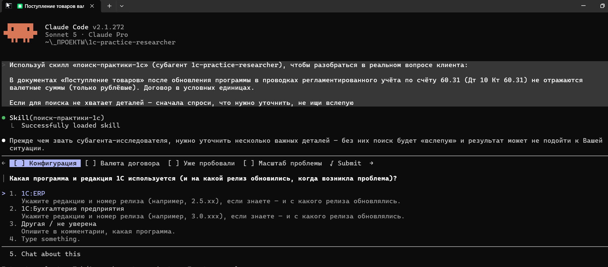
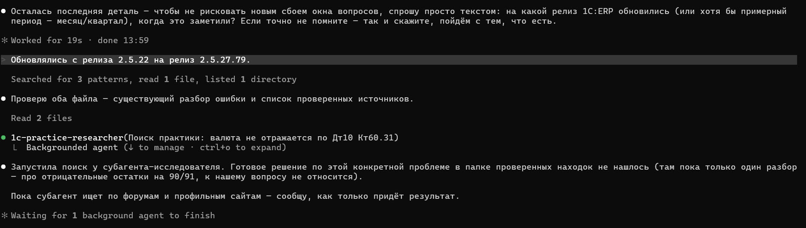
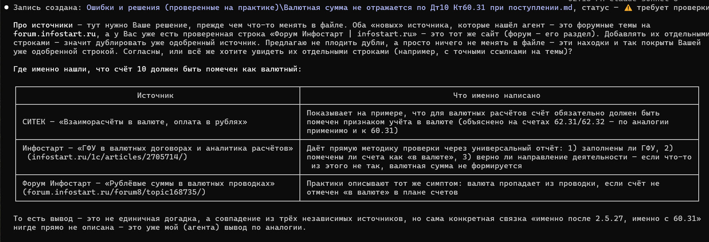
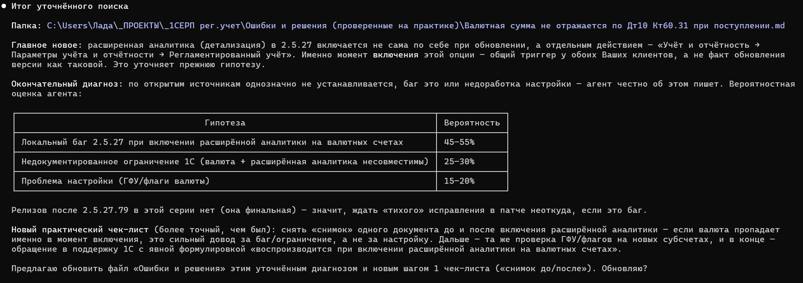

# 1C Practice Researcher

Исследовательский помощник для консультанта по 1С:ERP/Бухгалтерии — ищет не только официальную документацию, а реальный опыт практиков: обсуждения на форумах, статьи, разборы конкретных кейсов.

## Проблема

По нетиповым вопросам 1С:ERP официальной документации часто недостаточно — реальные решения появляются в обсуждениях на форумах и в статьях специалистов-практиков. Найти это руками — долго: нужно вручную перебирать несколько площадок, отделять актуальное от устаревшего, проверять достоверность.

Обычный чат-ассистент (Алиса, DeepSeek, Qwen и т.п.) тоже может «поискать и обобщить», но:
- не ограничивает себя проверенным кругом источников — в теме 1С в открытом интернете много устаревших и просто неверных советов;
- не учитывает контекст конкретной задачи консультанта (версия/редакция, что уже пробовали);
- не спрашивает уточнений, если вопрос сформулирован без деталей — просто гадает или отвечает обобщённо.

## Решение

Субагент `1c-practice-researcher` + скилл `поиск-практики-1с`:
- ищут по заведомо проверенному кругу источников — форумы, статьи, разборы коллег и конкурентов (список ведётся и пополняется отдельно, растёт только с подтверждения консультанта);
- учитывают вставленный вручную текст с портала ИТС (платный ресурс) как ещё один надёжный источник, и сами подсказывают, что и где именно искать на портале — ИТС этого не подсказывает сам;
- прежде чем искать — проверяют, достаточно ли деталей в задаче (версия/релиз, точный текст ошибки, при необходимости конкретный объект программы), и если нет — сначала задают уточняющие вопросы, а не ищут вслепую;
- при указании конкретного релиза или даты — не выглядят увереннее, чем сам источник: честно отмечают, если точности в источниках нет;
- честно говорят, если практики по теме почти нет, вместо того чтобы придумывать ответ.

## Результат

Структурированная таблица находок (источник, дата/релиз, полнота ответа, надёжность источника, практическая выжимка), готовая к использованию в реальной работе с клиентом — а не список случайных ссылок без разбора.

## Как использовать

1. Опишите задачу (проблему клиента, тему статьи или просто вопрос), по возможности сразу указав версию/редакцию 1С.
2. Если есть релевантный текст с ИТС — вставьте его в задачу отдельным блоком.
3. Скилл `поиск-практики-1с` сам проверит, хватает ли деталей, при необходимости уточнит, и передаст задачу субагенту `1c-practice-researcher`.
4. Получите структурированный ответ: краткий вывод + находки со ссылками.

## Пример работы

Реальный тест на вопросе консультанта: в документах «Поступление товаров» после обновления программы в проводках по счёту 60.31 (Дт 10 Кт 60.31) не отражаются валютные суммы, только рублёвые. Договор — в условных единицах.

**1. Прежде чем искать — агент уточняет детали, а не гадает:**

**2. Проверяет собственную базу знаний, затем передаёт задачу субагенту-исследователю:**

**3. Честно помечает источники, которых нет в проверенном списке, — не решает сам, добавлять ли их:**

**4. Итог — структурированная таблица гипотез с честной оценкой вероятности, а не один уверенный ответ:**

## Дальнейшее развитие (не входит в MVP)

- Встроенный поиск обновлений по регламентированному учёту (слияние со скиллом `сводка-изменений-в-учете`).
- Дальнейшее пополнение базы проверенных источников по мере накопления опыта.

## Статус

MVP готов, протестирован на реальной задаче консультанта (переход на расширенную детализацию регламентированного учёта в 1С:ERP).
